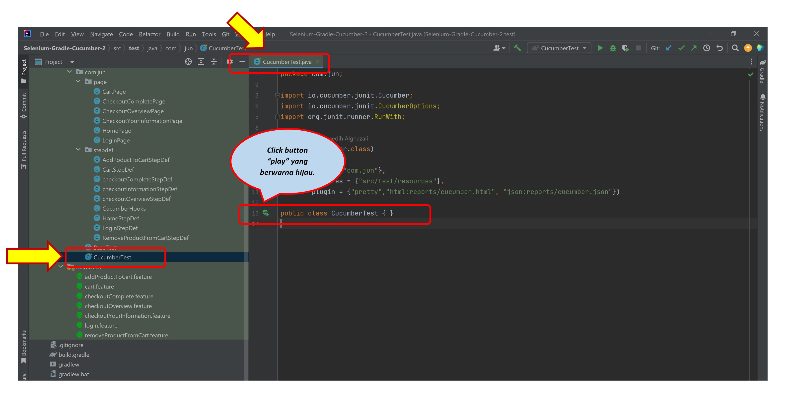
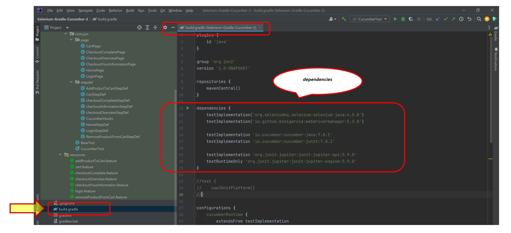
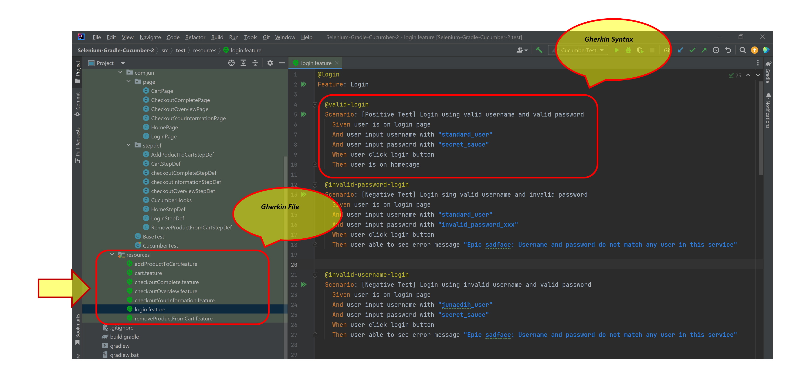
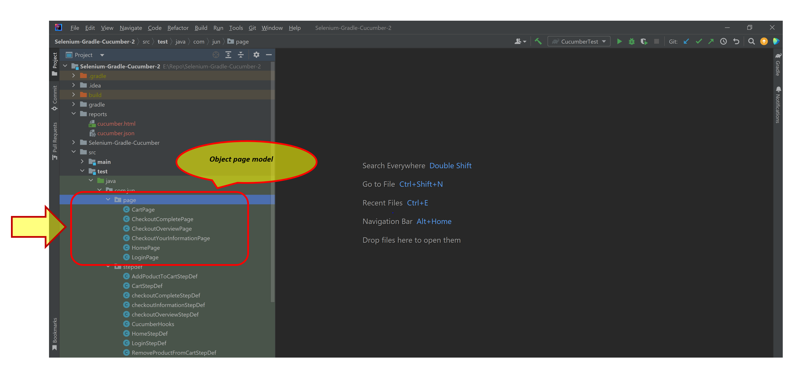
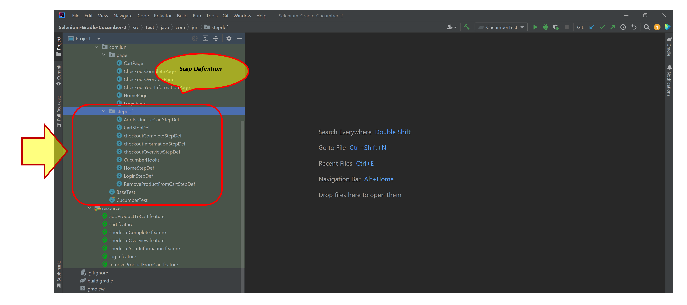
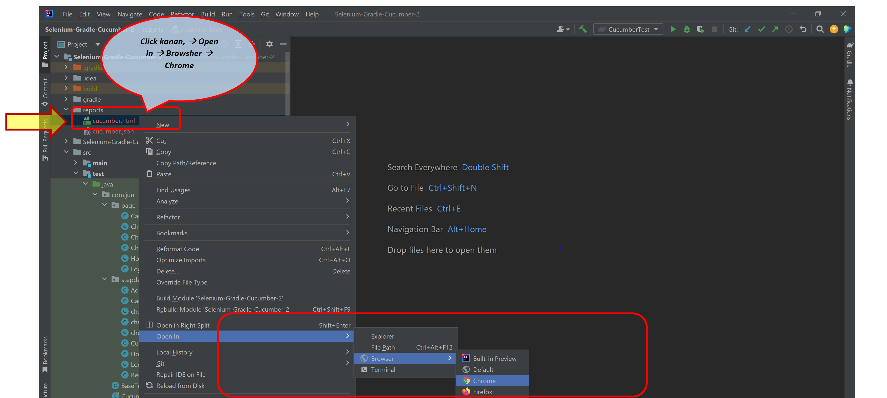
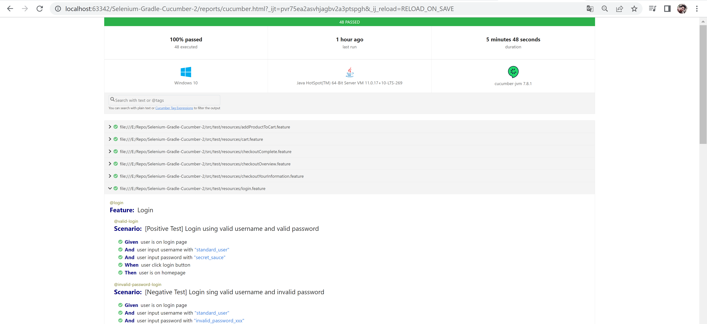

# Web UI Automation Test Framework

#### _Framework yang sangat memudahkan kita untuk menjalankan Test Scenario pada sebuah Applikasi Web Base (dalam study kasus ini : "https://www.saucedemo.com/"_
#### _Hanya satu kali click kita bisa menjalankan puluhan test scenario bahkan ratusan test scenario yang berjalan secara automatis. Sangat menghemat waktu dan lebih akurasi dibandingkan kita harus menjalankan test scenario secara manual, setelah running test selesai, kita dapat langsung melihat report nya._ 

## Running Cucumber Test

#### Kerangka pengujian UI Web menggunakan :
- Cucumber
- Java, JUnit
- Gradle
- Selenium Web Driver
- InteliJIDEA
- Browser Google Chrome

Project Gradle dengan konfigurasi dependensi Cucumber, Selenium, dan JUnit.
Menerapkan pola object page, dimana setiap halaman web dari aplikasi yang diuji direpresentasikan sebagai class Java yang terpisah. 

Class berisi semua pencari lokasi dan metode yang diperlukan untuk berinteraksi dengan elemen di halaman tersebut. Script test case  menggunakan Gherkin syntax, yang merupakan format bahasa alami untuk menggambarkan tes. 

Test case menjelaskan perilaku yang diharapkan dari aplikasi dalam hal fitur dan persyaratannya
Menggunakan Cucumber library untuk mendukung kasus pengujian Gherkin, menjalankannya, dan membuat laporan.

Test case pengujian otomatis mencakup tests positif (positive), negatif (negative), dan batas (boundaries).
Memverifikasi fungsionalitas aplikasi, memeriksa apakah aplikasi berperilaku seperti yang diharapkan dalam skenario yang berbeda. 

tujuan proyek dan cara menjalankan pengujian ??
informasi yang relevan tentang penyiapan dan konfigurasi proyek. ??

menjelaskan penerapan kerangka uji UI Web menggunakan Cucumber, Java, Gradle, dan Selenium.
Repositori berisi kode sumber untuk framework, implementasi Page Object Model, test case Gherkin, dan implementasi Cucumber.
Selain itu, repositori harus menyertakan kasus uji sampel untuk mendemonstrasikan fungsionalitas dari framework.

### Build Gradle

### Gherkin

### Object Page Model

### Running Cucumber Test

### Step Definition

### View Cucumber Report

